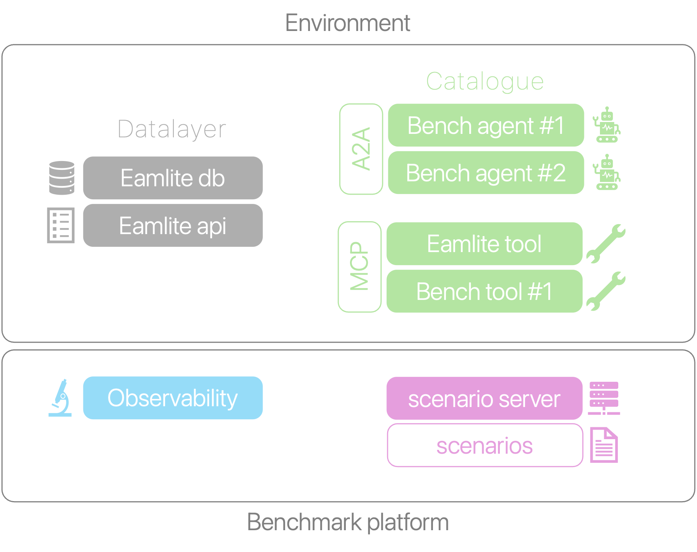

# AObench

AOBench is the next gen agentic benchmark for industrial asset operation. It comprises a data layer featuring a lite version of an EAM solution database: `eamlite`, and a relevant REST api for easy access; a scenario server to store and retrieve benchmarking scenarios and grade the agents trajectories, an observability platform and, a catalogue of tools and agents, accessible respectively via MCP and A2A protocols.

## Directory tree

The repository structure looks like the following.

```sh
aobench
├── compose.yml
├── datalayer
│   └── eamlite
│       ├── src/... 
│       └── compose.yml
├── catalogue​
│   ├── agents​
│   │   ├── a2a_ci
│   │   │    ├── src/...  
│   │   │    └── containerfile
│   │   └── ...
│   └── tools
│       ├── mcp_iottool
│       │    ├── src/...
│       │    └── containerfile
│       └── ...
├── observability
│   └── mlflow
└── scenarioserver​
    ├── lib/...
    └── server
        └── containerfile
```

The top level compose file spins up all the required services for the benchmark to function. The following diagram illustrates an instantiated benchmark instance.


